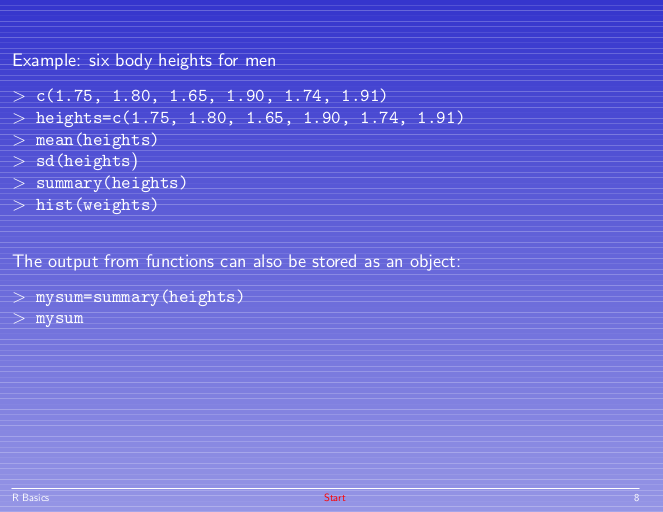
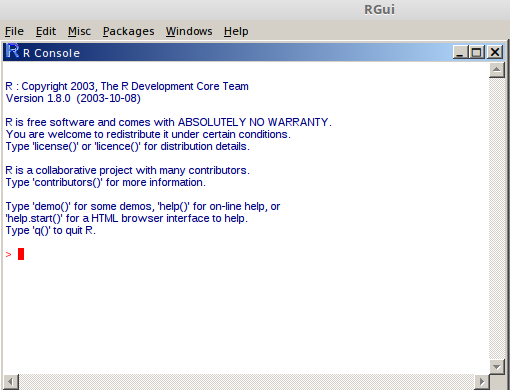
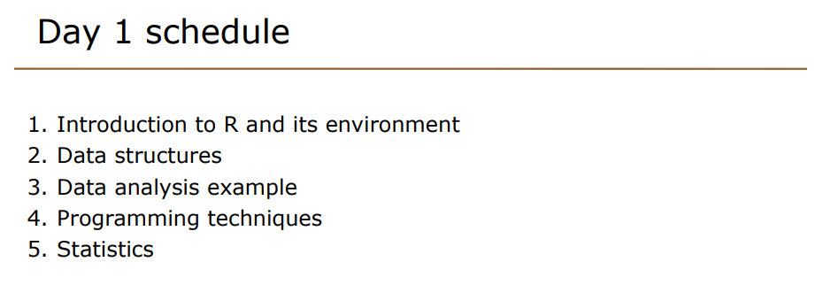
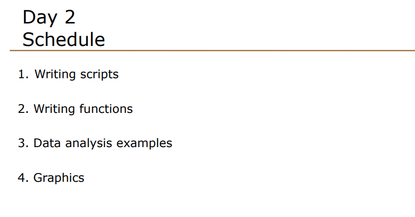
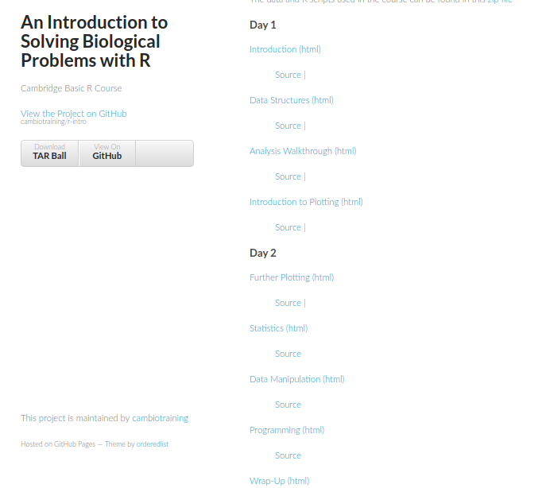
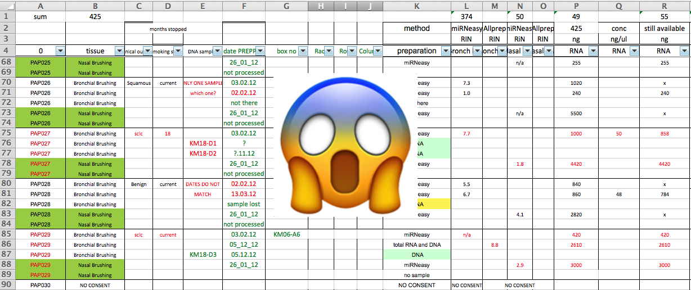

```{r setup, include=FALSE}
knitr::opts_chunk$set(echo = FALSE)
```

## Preamble

- How I came to be teaching R
- What I've learnt on the way
- Hints and tips when teaching / learning R

## How I learnt R

- Previous BSC in Computer Science
- Data Analysis Msc at York
- Statistics module taught using R
- PDF lectures with practicals afterwards



## How I learnt R

- We've come a long way!




## First attempts at teaching R

- ~2012/2013 (?)
- A pre-requisite to the courses I was already teaching
- Established and developed over a number of years
- Materials [still online](http://logic.sysbiol.cam.ac.uk/teaching/Rcourse/)

## Course schedule (2 days)





## Some common feedback (from participants and tutors)

- Plotting *at the end of the course*
    + most important part for some people
    + often skimmed over due to time constraints
- Datasets too hard
- Stats too hard
- Functions too hard

## Some common feedback (from participants and tutors)

- ~~Plotting *at end of the course*~~
    + moved much earlier
    + but something has to come at the end
- Datasets too hard
- Stats too hard
- ~~Functions too hard~~
    + removed from syllabus
    + were we probably trying to fit too much in
    
## Choice of dataset

- Tempting to use datasets that participants will use day-to-day
    + but can sometimes be complicated to explain
    + focus too much on the data and not the R code
    + not everyone will have the same background
- Generic dataset sometimes better
    + ozone / weather dataset
    + "patient" weights / heights
    + (gene expression dataset)
- Huge list of datasets with downloads thanks to [Vincent Arel Bundock](https://vincentarelbundock.github.io/Rdatasets/datasets.html)

## What to do about Stats

- People sometimes expect an R course to be about stats
- No-win situation
    + cut-back the stats and people want more
    + add more stats content and people complain it's too much :/
- (Personal opinon) Learning R and learning stats are separate activities
    + can either focus on R and neglect interpretation of stats, or vice-versa
    
## What to do about Stats

- Cover the use of `t.test`
    + doing paired t-test vs independent t-test not much harder (or `wilcox.test`)
    + difficulty is knowing what test to apply
- For basic stats, we developed [some Shiny apps](https://www.cruk.cam.ac.uk/core-facilities/bioinformatics-core/statistics-web-applications)
    + focus is on interpreting data and results
- Signpost to other stats courses or resources that assume R

## New course (Sept 2015)
http://cambiotraining.github.io/r-intro/



## What else did we change

- Introduced reproducibility and R markdown
- Slides generated with R markdown vs powerpoint
    + easier to update
- Eventually switch to HTML notes
    + no more handouts
- Good reviews, but not quite satisfied yet

## The big debate; tidyverse vs base

- What is best to teach novices?
- My preconception (at the time) that everyone learns base R first and then learns tidyverse afterwards
    + probably based on how I learnt R!
- Not all packages use ggplot2 for plotting
    + some types of data (e.g. Genomics) not traditionally "long" format
- (Spoiler alert - I eventually decided to teach tidyverse rather than base)

## New "intermediate R" course
- Online [here](http://bioinformatics-core-shared-training.github.io/r-intermediate/)
- Assumes some basic R knowledge
- Covers dplyr and ggplot2 in detail
- Simple simulated dataset of patient demographics

## Have we cracked it?

- New intermediate R is getting rave reviews
- Using best-practice tools
    + dplyr, ggplot2
    + R markdown, github
- So everyone is using R now?
    + why not
    + (those of a nervous disposition might want to look away)
    
## Because their data looks like this



## What other stuff to teach

- **Data formatting**
- Have to accept that people are going to use Excel
- Teach them to use it *safely*
    + no colours
    + one piece of data per column
    + no spaces
    + etc
- What about version control?    

## Enter the carpentries

https://carpentries.org/


## Software Carpentry


## Data Carpentry


## Other nice features

- Live coding
- Sticky notes
    - Yellow = Ready to move on
    - Pink = Help me
    - Also used to get feedback
- **Instructor training programme**

## Another new course

http://sbc.shef.ac.uk/training/r-introduction-2019-03-29/

- no more base R!
- live coding all the way
    + except 10 minute introduction
- using gapminder data

##

```{r echo=TRUE, fig.height=4}
suppressPackageStartupMessages(library(tidyverse))
read.csv("gapminder.csv") %>% 
  filter(continent!="Oceania") %>% 
  ggplot(aes(x=as.factor(year),y=lifeExp,fill=continent)) + geom_boxplot() + 
  facet_wrap(~continent)

```

## Thinking about running a course?

- Plenty of materials for re-use
    + carpentry materials can be used
- We are building a network of trainers
    + interested in carpentry instructor training? let us know
- Don't try and do too much
    + focus on Core skills, and do them well
- Do something exciting early on
    + a cool plot, filter some data
- Choose dataset carefully
    + unless you can guarentee background of participants, choose something generic. e.g. gapminder
    + maybe add an extra section analysing a domain-specific dataset

## Thinking about running a course    
    
- Setup on participant machines can be a headache
    + Tempting to use a computer room with everything pre-installed
    + But will they be able to use it afterwards?
- Send installation instructions in advance
    + offer drop-in sessions to help with install?
- Could use Docker / Virtual Machine
    + But could be as complicated to setup as R itself
    + Cloud compute is an option (AWS etc)